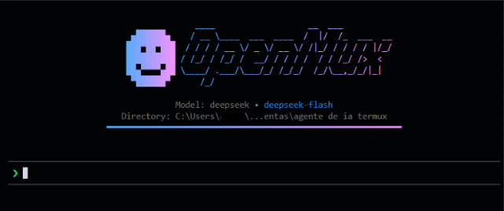

# 🤖 OpenMux

Um Agente de Inteligência Artificial **autônomo e interativo** projetado especificamente para o terminal do **Termux** no Android, mas totalmente funcional no PC e Mac. 

O **OpenMux** entende comandos de linguagem natural, lê seus arquivos, edita código, instala pacotes e opera o terminal direto pelo shell, sob sua total supervisão e permissão.

Construído 100% com React/Ink para uma interface de terminal fluida, com blocos isolados, arte responsiva e renderização Markdown nativa.

---

## ⚡ O que ele faz?

- 🧠 **Entende o Contexto** — Diga a ele o que fazer ("ajusta esse script python", "instala o ffmpeg", "cria uma pasta e move essas fotos").
- ⚙️ **Executa Comandos Bash** — Ele escreve o comando e pede sua permissão antes de apertar o "Enter".
- 📂 **Manipula Arquivos** — Cria, lê, edita, deleta e lista diretórios inteiros sem precisar de ferramentas externas.
- 💬 **Design Responsivo e Moderno** — Renderizado com **React Ink**, possui menus flutuantes em quadrados perfeitos, balões visuais e suporte a Markdown colorido em tempo real!
- 🌐 **Multi-Provedor** — Conecta a **8+ provedores de IA** com um único SDK (Groq, Gemini, OpenRouter, DeepSeek, OpenAI, Mistral, Together AI, Ollama).
- 💾 **Sessões Inteligentes (Auto-Save)** — Seu histórico é salvo em `~/.openmux/sessions/` com nomes gerados automaticamente baseados no assunto da sua conversa, e sessões vazias não sujam sua pasta.

---

## 📸 Preview

<div align="center">
  
</div>

---

## 🚀 Instalação e Uso

O agente requer Node.js instalado no sistema.

### Instalação Automática (Termux)

```bash
curl -sL https://raw.githubusercontent.com/Yeager13fg/Openmux/master/install.sh | bash
```

### Instalação (Local / PC)

```bash
git clone https://github.com/Yeager13fg/Openmux.git
cd Openmux
npm install
npm run build
```

### Como Iniciar
```bash
npm run dev
# ou
node dist/cli.js
```

### Configurar o provedor de IA (primeira vez)
Ao iniciar, basta digitar `/` na caixa de mensagem. O menu flutuante abrirá acima da sua barra de digitação.
Use a seta direcional para selecionar `/provider` e escolha seu provedor.

### Trocar o modelo
Digite `/` e selecione `/model`.

---

## ⌨️ Comandos Disponíveis (Slash Commands)

Todos os comandos agora são integrados ao chat via menu flutuante! Basta digitar `/`.

| Comando | Descrição |
|---------|-----------|
| `/provider` | Selecionar provedor de IA e configurar API Key |
| `/model` | Listar e trocar o modelo de IA ativo |
| `/session` | Recuperar e carregar o histórico de conversas passadas |
| `/clear` | Limpar o histórico da conversa na tela |
| `/exit` | Encerrar o agente (ou use `Ctrl+C`) |

---

## 🛠️ Ferramentas do Agente

O OpenMux possui **8 ferramentas nativas** para operar seu sistema:

| Ferramenta | Descrição | Segurança |
|------------|-----------|-----------|
| `bash_command` | Executa comandos no terminal | 🛑 Aprovação interativa (Setas do Teclado) |
| `create_file` | Cria novos arquivos | ⚠️ Pede permissão fora da pasta raiz |
| `read_file` | Lê conteúdo de arquivos | ⚠️ Pede permissão fora da pasta raiz |
| `edit_file` | Substitui blocos exatos de texto | ⚠️ Pede permissão fora da pasta raiz |
| `delete_path` | Apaga arquivos ou pastas | 🛑 Aprovação interativa (Setas do Teclado) |
| `create_directory` | Cria diretórios | ⚠️ Pede permissão fora da pasta raiz |
| `list_directory` | Lista arquivos e pastas | ⚠️ Pede permissão fora da pasta raiz |
| `ask_user` | Faz perguntas ao usuário | 💬 Abre um modal de pergunta interativa |

---

## 🧠 Provedores Suportados

| Provedor | Destaque | Gratuito? |
|----------|----------|-----------|
| **Groq** | Respostas ultrarrápidas | Sim. Plano gratuito generoso |
| **Google Gemini** | Janela de contexto gigante | Sim. Gratuito |
| **OpenRouter** | Acesso a 200+ modelos | Parcial (alguns modelos grátis) |
| **DeepSeek** | Excelente raciocínio e Custo baixo | Pago (muito barato) |
| **OpenAI** | GPT-4o, o3-mini | Pago |
| **Mistral** | Codestral, Mistral Large | Parcial |
| **Together AI** | Modelos open-source | Parcial |
| **Ollama** | 100% local e offline | Sim. Gratuito (requer servidor) |

> 💡 **Dica para começar grátis no Android**: Use o **Google Gemini** (Gemini 2.5 Flash) via API Key gratuita!

---

## 🧩 Arquitetura

O projeto foi totalmente reescrito na v2.0 para utilizar **React Ink**:

```
src/
├── cli.ts              # Ponto de entrada
├── repl.tsx            # Ponto de montagem e Logo ASCII
├── App.tsx             # Interface de Usuário Principal (React/Ink)
├── agent.ts            # Núcleo do agente (streaming AI)
├── llm.ts              # Cliente OpenAI universal
├── config.ts           # Gerenciamento de configuração local
├── session.ts          # Salvamento automático do log da sessão
├── providers.ts        # 8 provedores pré-configurados
├── system-prompt.ts    # Prompt de sistema em português
├── security.ts         # Validação de acesso a caminhos
├── types.ts            # Tipagens TypeScript
└── tools/              # Ferramentas individuais
```

Consulte o arquivo [documentacao.md](documentacao.md) para o detalhamento técnico atualizado.

---

## 📄 Licença

Este projeto está licenciado sob a licença MIT. Veja o arquivo [LICENSE](LICENSE) para mais detalhes.
